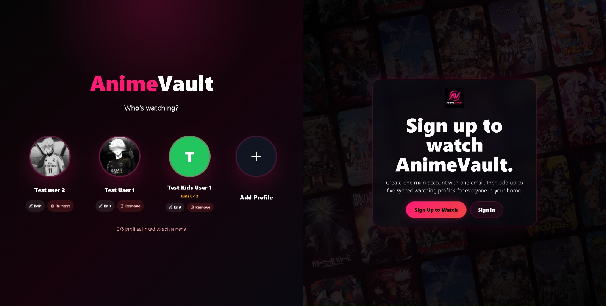
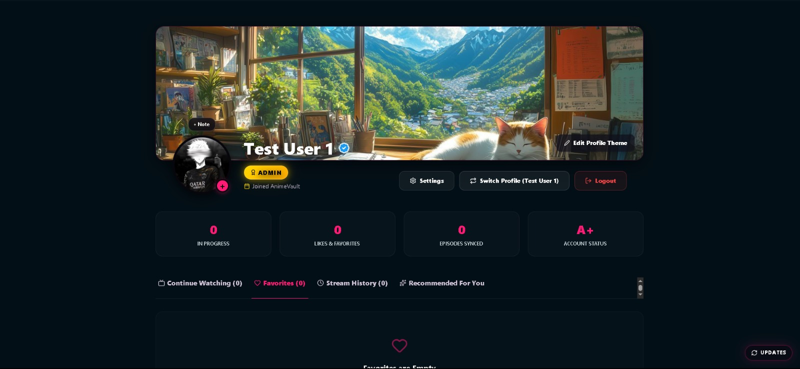
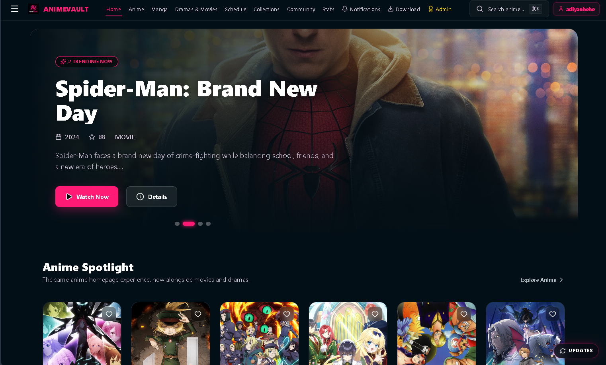
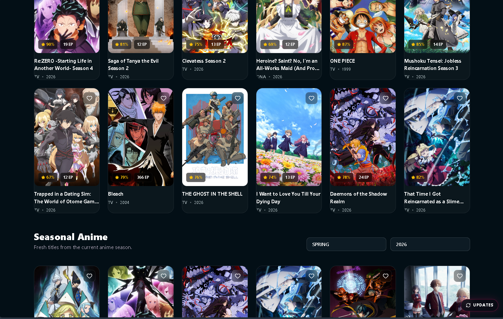
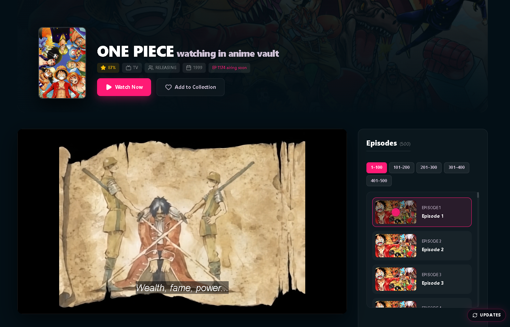
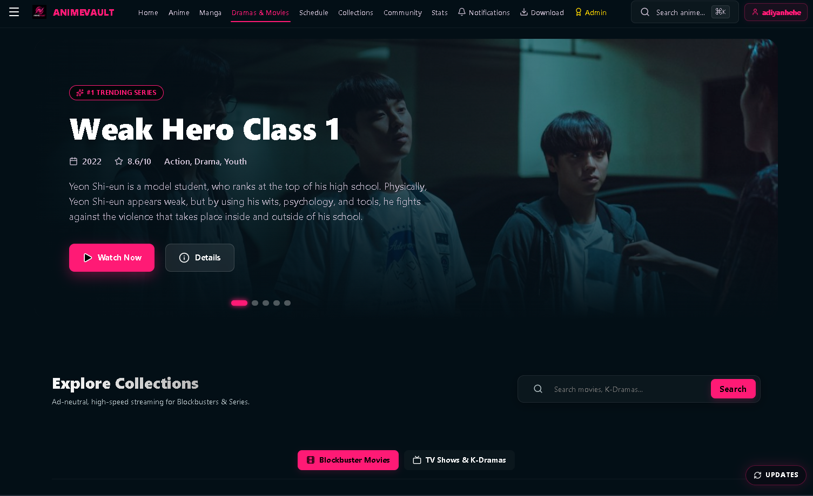
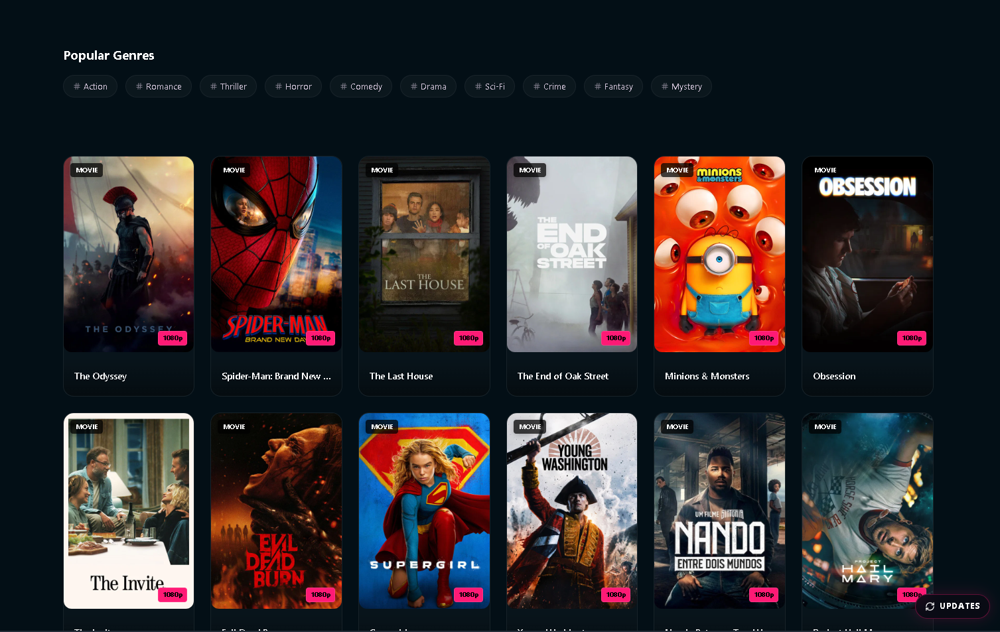
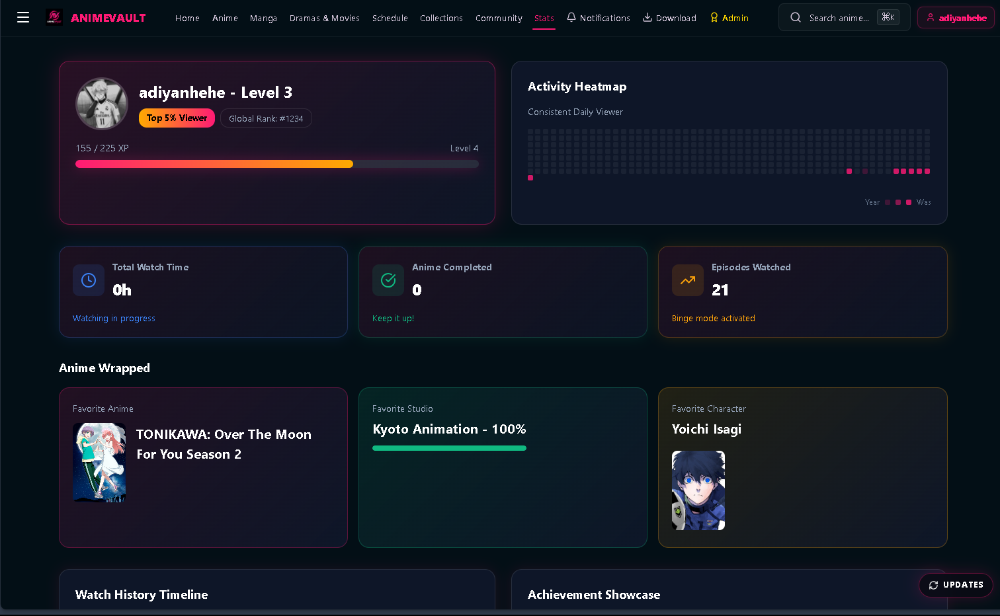

# ⛩️ AnimeVault

> The ultimate, feature-packed web application and desktop client for streaming anime, movies, dramas, and reading manga—completely free and zero clutter.

---

## 📸 Preview

  
  
  
  
  
  
  
  

---

## ✨ Features

* **⚡ Fast Streaming:** Ultra-low latency video player with modern controls and smooth playback.
* **📦 Massive Library:** Dive into a sprawling catalog of [Animes](https://animevaultofficial.fun/#/search?type=ANIME), live-action [Dramas & Movies](https://animevaultofficial.fun/#/dramas-movies), and [Mangas](https://animevaultofficial.fun/#/search?type=MANGA) all in one place.
* **📊 Progress Tracking:** Automatically save your watch history and pick up right where you left off across sessions.
* **💻 Cross-Platform & Desktop First:** Native desktop installers for Windows, macOS, and Linux featuring Discord Rich Presence support, plus a dedicated Android APK.
* **🔍 Instant Search:** Quick-launch search functionality powered by keyboard shortcuts ($\text{Cmd/Ctrl + K}$).

---

## 📥 Downloads & Installation

Get the latest release assets (v0.2.185) directly from [GitHub Releases](https://github.com/animevaultofficial/animevaultofficial.github.io/releases/latest).

| Platform | Recommended Asset | Description |
| :--- | :--- | :--- |
| **Windows** (`10 / 11`) | [AnimeVault Windows x64 v0.2.185.exe](https://github.com/animevaultofficial/animevaultofficial.github.io/releases/latest/download/AnimeVault-Windows-x64.exe) | Fast native desktop installer with auto-updates. |
| **macOS** (`12+`) | [AnimeVault macOS Apple Silicon v0.2.185.dmg](https://github.com/animevaultofficial/animevaultofficial.github.io/releases/latest/download/AnimeVault-macOS-arm64.dmg) | Universal Apple Silicon DMG. |
| **Linux** (`Ubuntu/Debian`) | [AnimeVault Linux x64 v0.2.185.AppImage](https://github.com/animevaultofficial/animevaultofficial.github.io/releases/latest/download/AnimeVault-Linux-x64.AppImage) | Portable AppImage build (make executable and run). |
| **Android** (`6+`) | [AnimeVault Android v0.2.185.apk](https://github.com/animevaultofficial/animevaultofficial.github.io/releases/latest/download/AnimeVault-Android.apk) | Sideloadable mobile app release. |

---

## 🚀 Tech Stack & Pipeline

* **Frontend:** Responsive web app with dynamic routing for Anime, Manga, Schedule, Collections, and User Profiles.
* **CI/CD:** Automated builds, packaging, and tagging straight to GitHub Releases via package management workflows.

---

## ⚠️ Disclaimer

> AnimeVault does not store any files on its servers. All contents are provided by non-affiliated third parties.

---

© 2026 AnimeVault • All Rights Reserved
